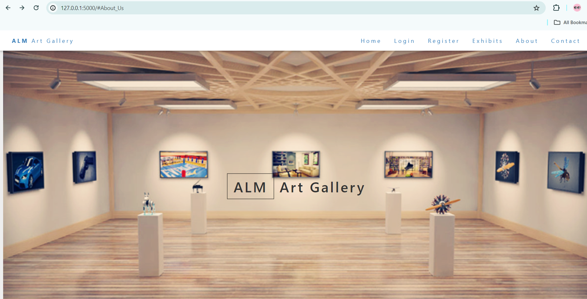

# Virtual-art-gallery
 Created a new repository for Hack Innovate Hackathon. This repository is built during the hackathon Hack Innovate which has taken place during Innovate Tech Fest at SRM Institute of Science and Technology.
 # Art-Gallery-Website
Open source website for viewing arts and paintings.

This website uses a number of open source projects to work properly:

* [Flask] -  Python Web framework
* [Bootstrap] -  Our frontend framework

